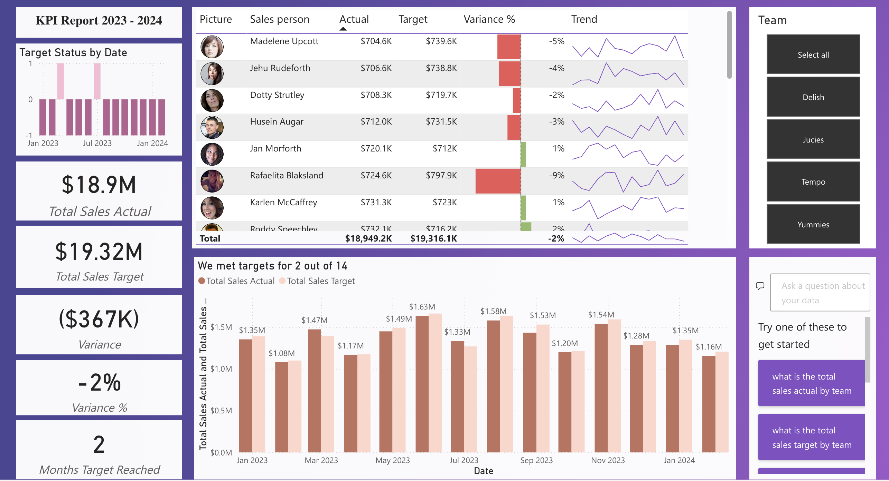

# **Finance KPI Dashboard Project**

  

## **Project Overview**
This project focuses on developing a **Finance KPI Dashboard** using **Power BI**, designed to monitor and evaluate key financial metrics within an organization. The dashboard provides actionable insights into the performance of sales teams and individual employees, enabling stakeholders to track progress towards financial goals.

## **Core Processes**

### **1. Data Cleansing and Data Modeling**
- **Data Preparation:** Cleaned and structured raw data using **Power Query** by:
  - Removing inconsistencies
  - Handling missing values
  - Transforming data into an analysis-ready format

- **Data Modeling:** Built a data model to establish relationships between different datasets for efficient reporting.

### **2. DAX Calculations**
Created DAX (Data Analysis Expressions) calculations to derive key Performance Indicators (KPIs) and financial figures, including:

- **Total Sales (Actual):** The sum of actual sales achieved over a specific period.
- **Total Targeted Sales:** The total sales goal set for that period.
- **Year-to-Date (YTD) Actual and Target:** Cumulative actual and target sales up to the current date.
- **Variance:** The difference between actual and targeted sales.
- **Variance Percentage:** The percentage difference between actual and targeted sales.

### **3. Performance Insights**
The dashboard provides insights into the frequency of meeting monthly sales targets, allowing users to:

- Track individual employee performance over time
- Compare actual sales against targeted sales on a monthly basis
- Identify high performers and those needing support

### **4. Team-Wise Selection and Salesperson Metrics**
- **Interactive Filters:** Users can filter data by sales team to conduct deeper analysis.
- **Key Metrics Displayed:**
  - Actual Sales
  - Target Sales
  - Variance and Variance Percentage
  - Sales Trend Analysis

## **Technology and Tools**
- **Power BI:** For creating the interactive dashboard, building data models, and designing visuals.
- **Power Query:** For data cleansing and transformation.
- **DAX:** For complex calculations and deriving meaningful insights.

## **Impact of the Dashboard**
This project showcases proficiency in data analysis, visualization, and financial reporting. The dashboard:

- Tracks KPIs and helps stakeholders understand sales performance at both employee and team levels.
- Allows for quick identification of areas for improvement through variance and trend analysis.
- Features interactive capabilities for users to filter data and monitor performance metrics effectively.

## **Power BI Dashboard Link**
[View the Dashboard](https://app.powerbi.com/links/TjtzgVMyLJ?ctid=0347d89a-0174-4dd3-adeb-3339c89c35f5&pbi_source=linkShare)

